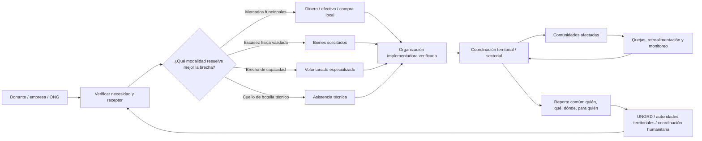

# Necesidades y formas de aportar dentro y fuera de Colombia después del terremoto

## Resumen ejecutivo

**Fecha de consulta y corte documental: 11 de agosto de 2026, hora de Colombia.** Dado que no se especificó un terremoto, este informe toma como referencia **el evento principal más reciente con impacto humanitario significativo en Colombia**: el sismo del **10 de agosto de 2026 a las 7:34 a. m.**, de **magnitud 7,4**, con epicentro en **San José del Palmar, Chocó**, y profundidad actualizada por el Servicio Geológico Colombiano (SGC) a **103 km**. El SGC informó una intensidad máxima reportada de 7 y numerosas réplicas; la UNGRD señaló afectaciones iniciales bajo verificación en municipios de Chocó, Caldas, Valle del Cauca, Risaralda y Quindío. citeturn16view0turn17view0

La situación sigue en fase de **búsqueda, rescate y evaluación rápida**. Al 11 de agosto, la Federación Internacional de la Cruz Roja y de la Media Luna Roja (IFRC) confirmó daños en **viviendas, escuelas, instalaciones sanitarias, carreteras y puentes**, colapso de edificios y dificultades de acceso, particularmente en Chocó, incluidas interrupciones viales y aeroportuarias. La propia IFRC advierte que las cifras de víctimas y daños continúan siendo preliminares y cambian rápidamente. Por ello, un balance oficial consolidado y definitivo de personas fallecidas, heridas, desplazadas o con vivienda inhabitable es, para efectos de este informe, **“no especificado al 11 de agosto de 2026”**. citeturn17view1

La prioridad operacional inmediata es **salvar vidas y mantener servicios esenciales**: búsqueda y rescate; trauma, cirugía y atención primaria; agua segura y saneamiento; alojamiento temporal; alimentos o transferencias monetarias cuando los mercados funcionen; protección de personas en mayor riesgo; electricidad, telecomunicaciones y acceso logístico. La UNGRD mantiene activa la Sala de Crisis Nacional y ha movilizado capacidades USAR, mientras la Cruz Roja Colombiana opera equipos de búsqueda y rescate y su Sala Nacional de Crisis. citeturn17view0turn17view1

Para la mayoría de donantes individuales y empresas, **una transferencia monetaria a una organización verificada es normalmente más útil que enviar bienes por cuenta propia**, siempre que los mercados y sistemas de pago sigan funcionando. La evidencia humanitaria recopilada por CALP encuentra que el efectivo suele tener menores costos de entrega que la ayuda en especie, pero la modalidad debe decidirse según mercados, seguridad, preferencias comunitarias y disponibilidad local. citeturn16view8

**Lo más recomendable hoy es:**

1. Donar mediante **Cruz Roja Colombiana/IFRC u otra entidad con presencia comprobada**, y no mediante cuentas personales difundidas únicamente por redes sociales. La Cruz Roja Colombiana activó su respuesta y su portal oficial dispone de opciones de apoyo para las comunidades afectadas. citeturn14search0turn4search2turn17view1
2. **No enviar ropa, medicamentos, alimentos u otros bienes de forma espontánea.** Los insumos médicos, en particular, deben responder a necesidades expresamente identificadas; la experiencia documentada por la OMS muestra problemas de desperdicio, clasificación y pertinencia cuando las donaciones farmacéuticas no se coordinan. citeturn22search3
3. **No desplazarse como voluntario independiente** a Chocó u otras zonas afectadas. Los voluntarios deben incorporarse a organizaciones formalmente coordinadas, con capacitación, seguridad, alojamiento y logística resueltos. Para extranjeros existen además requisitos migratorios específicos. citeturn19view0
4. Empresas y ONG deberían priorizar capacidades difíciles de conseguir localmente —ingeniería estructural, WASH, logística, telecomunicaciones, salud, gestión de información y cadena de suministro— **solo después de recibir una solicitud o términos de referencia concretos**.
5. Desde el exterior, recaudar fondos y efectuar incidencia pública puede ser más eficiente que organizar cargamentos: campañas corporativas de *matching*, donaciones de diáspora y apoyo a entidades humanitarias reconocidas evitan costos de transporte, aduanas y almacenamiento.

## Contexto del evento y situación verificada

Para evitar confundir el sismo principal con las réplicas posteriores, el “terremoto de referencia” de este informe es el **evento M7,4 del 10 de agosto**, no cada movimiento menor posterior de la misma secuencia sísmica. El SGC indicó que, al momento de su comunicado del 10 de agosto, ya había registrado 18 réplicas y advirtió que estas podían continuar. citeturn16view0

| Variable | Información verificada al 11 de agosto de 2026 |
|---|---|
| Fecha y hora | 10 de agosto de 2026, 7:34 a. m. |
| Magnitud | 7,4 |
| Epicentro | San José del Palmar, Chocó |
| Profundidad actualizada | 103 km |
| Intensidad máxima reportada | 7, asociada por el SGC con daño severo |
| Alcance sentido | Más de 12.000 reportes desde unos 900 centros poblados al momento del comunicado del SGC; también hubo reportes desde Panamá y Venezuela |
| Zonas con posibles afectaciones iniciales | 9 municipios de Chocó, 8 de Caldas, 2 de Valle del Cauca, 2 de Risaralda y varios de Quindío, según el primer reporte de UNGRD |
| Daños confirmados de forma general | Viviendas, escuelas, establecimientos de salud, vías y puentes; decenas de edificaciones colapsadas según IFRC |
| Balance definitivo de muertos/heridos/desplazados | **No especificado al 11/08/2026**; cifras todavía preliminares y cambiantes |
| Restricciones logísticas | Acceso especialmente difícil en Chocó; cierres aeroportuarios y afectaciones viales en distintas áreas |

Fuentes: SGC, UNGRD e IFRC. citeturn16view0turn17view0turn17view1

La **UNGRD** informó la activación del Comité Nacional para el Manejo de Desastres, de la Sala de Crisis Nacional y de cuatro grupos USAR procedentes de Bogotá, Envigado, Yopal y Medellín; las autoridades territoriales continúan verificando viviendas e infraestructura y construyendo la evaluación de necesidades. citeturn17view0 La **Cruz Roja Colombiana**, por su parte, desplegó equipos de búsqueda y rescate de Antioquia, Quindío y Caldas, incluidos 30 rescatistas enviados desde Antioquia hacia Chocó; IFRC activó su preparación para una emergencia de gran escala. citeturn17view1

Esto tiene una consecuencia importante para los donantes: **todavía es prematuro convertir cifras de prensa en presupuestos definitivos de reconstrucción**. En las primeras jornadas, las prioridades deben actualizarse con evaluaciones EDAN/sectoriales y con información municipal, departamental y nacional. La Ley 1523 establece precisamente una arquitectura territorial y nacional de respuesta, recuperación e información bajo el Sistema Nacional de Gestión del Riesgo de Desastres (SNGRD). citeturn21search6

Además, el terremoto se superpone a un entorno humanitario colombiano ya complejo. OCHA estimaba para 2026 millones de personas con necesidades humanitarias derivadas de otras crisis, y el Gobierno y el Equipo Humanitario País ya operaban un Plan de Respuesta a Necesidades Humanitarias. La nueva emergencia, por tanto, debe evitar desplazar recursos esenciales de comunidades que ya enfrentaban conflicto, desplazamiento y otras vulnerabilidades. citeturn15search6turn15search2

## Evaluación de necesidades humanitarias

La siguiente evaluación distingue entre **necesidades ya sustentadas por daños reportados** y necesidades que, aunque previsibles después de un terremoto de esta magnitud, todavía requieren cuantificación local.

| Sector | Situación y necesidad inmediata | Prioridad operacional |
|---|---|---|
| **Salud** | Hay daños reportados en instalaciones sanitarias; pueden coexistir trauma, fracturas, heridas, necesidades quirúrgicas, continuidad de enfermedades crónicas, atención materna y reposición de medicamentos. citeturn17view1 | Triage, estabilización y referencia; bancos de sangre y cirugía según demanda; mantener atención primaria y medicamentos esenciales; equipos médicos solo cuando hayan sido solicitados y puedan integrarse al sistema local. |
| **Agua, saneamiento e higiene** | Alcance de daños a redes: **no especificado** al corte. Debe verificarse contaminación, presión de red, almacenamiento y saneamiento en albergues. Los estándares Sphere utilizan como referencia humanitaria al menos unos **15 L/persona/día**, ajustables al contexto. citeturn20search4 | Agua segura, cloración/control de calidad, tanques y almacenamiento, letrinas, lavado de manos, gestión de residuos y kits de higiene. UNICEF diseña sus kits WASH familiares para un mes e incluye recipientes, jabón y elementos de higiene menstrual. citeturn19view6 |
| **Refugio** | Viviendas dañadas y edificios colapsados están confirmados; número total de hogares inhabitables: **no especificado**. citeturn17view1 | Evaluación estructural antes del reingreso; alojamiento con familiares/hoteles cuando sea viable, seguido de soluciones temporales; lonas, iluminación, mantas, utensilios y reparaciones de emergencia conforme a necesidades verificadas. |
| **Alimentación** | Brecha alimentaria cuantificada: **no especificada**. El principal riesgo inmediato es que el daño y las interrupciones de transporte impidan acceso físico y reposición de mercados. citeturn17view1 | Alimentación preparada donde no haya cocina; luego efectivo/vouchers o compra local si mercados y pagos están funcionando. CALP recomienda decidir modalidad según disponibilidad, seguridad, mercados y preferencias de la población. citeturn16view8 |
| **Protección** | Incidentes específicos: **no especificados**; sin embargo, separación familiar, pérdida de documentos, hacinamiento y albergues mal diseñados pueden elevar riesgos. La OMS advierte que respuestas con hacinamiento o falta de privacidad pueden crear problemas adicionales. citeturn16view9 | Registro y reunificación familiar; iluminación y privacidad; accesibilidad; mecanismos de denuncia; protección de niñez y sobrevivientes de violencia; participación de mujeres, personas mayores, con discapacidad y comunidades étnicas. |
| **Comunicaciones y logística** | Daños viales, puentes, cierres aeroportuarios y dificultades de acceso en Chocó ya afectan la planificación logística. citeturn17view1 | Energía de respaldo, radios y conectividad satelital donde falle la red; información común sobre carreteras, helipuertos, bodegas y combustible; priorización del transporte para SAR, salud y agua. |

En salud, conviene **comprar o movilizar suministros normalizados en lugar de recibir cajas heterogéneas**. El Interagency Emergency Health Kit de UNICEF/OMS y socios, por ejemplo, está estructurado para apoyar atención primaria de unas 10.000 personas durante tres meses y se organiza en módulos de medicamentos, consumibles y equipos con logística estandarizada. No significa que Colombia necesite exactamente ese kit, pero ilustra el nivel de especificación que debería exigirse a cualquier donación médica. citeturn19view7

A **mediano y largo plazo**, las necesidades pasan de “sobrevivir al terremoto” a “recuperarse sin reconstruir el riesgo anterior”:

**Reconstrucción y vivienda.** Se requerirán inspecciones estructurales y geotécnicas, reparación de daños reparables, reconstrucción de viviendas perdidas y recuperación de escuelas, establecimientos de salud, vías, puentes, agua y energía. La Ley 1523 exige integrar reducción del riesgo en la recuperación, planificación territorial e inversión pública, en vez de limitarse a reponer infraestructura igual a la destruida. citeturn21search6

**Salud mental y apoyo psicosocial.** La mayoría de las personas experimentará algún grado de angustia después de una emergencia; la OMS recomienda un sistema escalonado que vaya desde redes comunitarias e información clara hasta primeros auxilios psicológicos, atención primaria y servicios clínicos especializados para quienes los requieran. También recomienda un mecanismo de coordinación MHPSS para evitar fragmentación. citeturn16view9

**Economía local.** Las transferencias monetarias, subvenciones a pequeños negocios, reparación de activos productivos, efectivo por trabajo y adquisiciones locales pueden simultáneamente atender necesidades familiares y acelerar la reactivación económica, pero únicamente donde los mercados tengan oferta suficiente y no exista riesgo significativo de inflación o inseguridad. citeturn16view8

**Educación.** Dado que IFRC reporta escuelas dañadas, se necesitarán evaluaciones de seguridad, espacios temporales de aprendizaje, materiales, continuidad docente, conectividad donde corresponda y reparación/reconstrucción segura. citeturn17view1turn20search12

## Actores clave y arquitectura de respuesta

**Gobierno colombiano y SNGRD.** La **UNGRD** debe ser el nodo nacional de articulación entre ministerios, gobernaciones, alcaldías, cuerpos de socorro, sector privado y organizaciones humanitarias. Gobernadores y alcaldes conducen el sistema en sus respectivas jurisdicciones, mientras que el SNGRD integra actores públicos, privados y comunitarios. La Ley 1523 también permite al Fondo Nacional de Gestión del Riesgo de Desastres recibir contribuciones de origen nacional o internacional para preparación, respuesta, rehabilitación y reconstrucción. citeturn21search6

El **SGC** es la fuente técnica primaria para magnitud, localización, profundidad y réplicas; no debe confundirse su función con la de asignar ayuda humanitaria. citeturn16view0 Ministerios como Salud, Vivienda, Transporte, TIC y Educación deben liderar técnicamente sus sectores en coordinación con UNGRD y autoridades territoriales.

**Cruz Roja Colombiana e IFRC.** La Cruz Roja Colombiana ya está operando búsqueda y rescate y evaluaciones, con respaldo de IFRC. Además de respuesta inmediata, la red de Cruz Roja tiene capacidades en salud, WASH, alojamiento, transferencias monetarias, protección y recuperación comunitaria. citeturn17view1 Para el donante general, es uno de los canales más fáciles de verificar mediante sus sitios oficiales. citeturn4search2

**OCHA y Equipo Humanitario País.** OCHA mantiene la arquitectura de coordinación humanitaria internacional en Colombia y el Equipo Humanitario País ya trabajaba conjuntamente con el Gobierno en el HNRP 2026. Su valor añadido en una emergencia de gran escala es apoyar coordinación interagencial, análisis, gestión de información, mapeo de quién hace qué y dónde, y enlace con mecanismos internacionales cuando la capacidad nacional solicita ese complemento. citeturn15search2turn15search6 La activación o financiación específica de todos esos mecanismos para este terremoto es **no especificada al 11/08/2026**.

**ACNUR y protección.** Colombia cuenta con una arquitectura activa de coordinación de protección; ACNUR es uno de sus actores centrales. En un terremoto, su aporte más relevante sería, si se solicita o activa para esta respuesta, apoyar protección de personas desplazadas, documentación, alojamiento/protección y derivación de casos, evitando duplicar la autoridad nacional. Un despliegue específico de ACNUR atribuido exclusivamente al terremoto era **no especificado** en las fuentes consultadas al corte. citeturn15search1turn15search5

**ONG internacionales.** Organizaciones con presencia previa pueden ampliar operaciones más rápidamente que nuevas entidades llegadas desde el exterior. El International Rescue Committee, por ejemplo, informó que estaba preparado para ampliar su respuesta en Colombia tras el terremoto y ya tenía trabajo en salud, protección, educación y medios de vida. citeturn19view8 También pueden entrar organizaciones médicas o logísticas especializadas, pero su utilidad debe evaluarse según solicitudes y brechas reales.

**Organizaciones locales y comunitarias.** Son críticas las asociaciones territoriales, organizaciones de base, juntas de acción comunal, redes de salud, organizaciones indígenas y afrodescendientes, asociaciones de mujeres y organizaciones locales de personas con discapacidad. La Ley 1523 exige promover la participación comunitaria y respetar la diversidad cultural. citeturn21search6 Una **lista pública consolidada de ONG locales específicamente acreditadas para este terremoto es “no especificada” al 11/08/2026**; por ello, antes de donar directamente debe verificarse personería jurídica, NIT, presencia efectiva y coordinación con las autoridades locales.

**Donantes.** Incluyen personas, empresas, fundaciones, diáspora colombiana, gobiernos extranjeros, sociedades nacionales de Cruz Roja/Media Luna Roja e instituciones multilaterales. Su función no debería ser crear una estructura paralela, sino **financiar las prioridades identificadas por la respuesta nacional y los actores que ya tienen acceso**.

## Cómo aportar desde Colombia y desde el exterior

### Comparación práctica de modalidades

| Modalidad | Ventajas | Desventajas y riesgos | Requisitos recomendados | Tiempo probable hasta generar valor |
|---|---|---|---|---|
| **Donación monetaria** | Flexible; permite comprar lo que realmente se necesita; puede apoyar comercios locales; menor costo logístico. CALP encuentra que suele ser más eficiente que la especie cuando existen mercados y pagos funcionales. citeturn16view8 | Fraude, campañas falsas, excesiva restricción del destino; efectivo directo a hogares puede ser inadecuado si mercados están destruidos. | Organización verificable; canal oficial; comprobante; política de rendición de cuentas; para beneficio fiscal colombiano, revisar situación RTE. | Horas a pocos días |
| **Bienes** | Útiles cuando existe escasez física concreta o un artículo especializado no está disponible localmente. | Transporte, aduanas, bodegaje, clasificación, desperdicio, artículos inadecuados y presión sobre accesos. | **Solicitud escrita/lista validada antes de comprar**; receptor/consignatario confirmado; especificaciones, cantidades, valor, lote/caducidad cuando aplique; plan de última milla. | Días a semanas |
| **Voluntariado** | Puede cubrir capacidades específicas y construir solidaridad local. | Voluntarios no capacitados consumen alojamiento, transporte, EPP, supervisión y seguridad; riesgo de accidentes y de interferir con rescate. | Registro con organización; perfil solicitado; inducción, seguro, EPP y cadena de mando. Extranjeros: requisitos migratorios según actividad. | Días a semanas |
| **Apoyo técnico** | Ingeniería, GIS, telecom, WASH, logística, adquisiciones, datos o finanzas pueden resolver cuellos de botella; parte puede hacerse remotamente. | Soluciones incompatibles, diagnósticos duplicados, riesgo de datos personales y dependencia de tecnología. | Términos de referencia; contraparte local; estándares interoperables; licencias profesionales cuando correspondan; entrega de documentación y transferencia de conocimiento. | Horas en remoto; días para despliegue |

**Desde dentro de Colombia**, la opción más sencilla para una persona es donar directamente por el **portal oficial de la Cruz Roja Colombiana** u otra ESAL cuya existencia, NIT y actividad puedan verificarse. Si se desea beneficio tributario, la DIAN aclara que una ESAL puede recibir donaciones sin estar en el Régimen Tributario Especial, pero **el donante solo accede al beneficio correspondiente cuando se cumplen las condiciones del RTE**; el certificado debe señalar forma, monto y destino y estar firmado por contador o revisor fiscal según corresponda. citeturn16view4

El Fondo Nacional de Gestión del Riesgo puede legalmente recibir aportes nacionales e internacionales, pero **no localicé en las fuentes oficiales consultadas una cuenta bancaria pública específica y verificada para donaciones de particulares destinada a este terremoto al 11/08/2026**. La existencia jurídica del Fondo no debe interpretarse como autorización para transferir a números de cuenta que circulen por WhatsApp o redes sociales. Verifique primero cualquier instrucción en el portal oficial de UNGRD. citeturn21search6turn17view0

**Desde el exterior**, las vías de menor fricción son la **IFRC**, una Sociedad Nacional de Cruz Roja/Media Luna Roja reconocida en el país del donante, u organizaciones internacionales con operación comprobada en Colombia. IFRC está apoyando activamente a la Cruz Roja Colombiana. citeturn17view1 El IRC también confirmó capacidad para ampliar respuesta. citeturn19view8 El tratamiento tributario de una donación efectuada fuera de Colombia depende del país del donante y debe verificarse allí.

Para **recaudación colectiva**, conviene que la campaña indique antes de recibir dinero: beneficiario jurídico final, porcentaje de tarifas, propósito, fecha de transferencia, mecanismo para devolver o redirigir excedentes y publicación posterior del monto entregado. Las empresas pueden multiplicar impacto mediante *matching* de empleados y financiando gastos operativos que los pequeños donantes suelen evitar —transporte, sistemas de información, personal técnico o bodegas— siempre que esos gastos hayan sido presupuestados por el implementador.

La **incidencia o lobby humanitario** puede orientarse a que empresas, cámaras de comercio, universidades, fundaciones y gobiernos extranjeros financien necesidades verificadas, flexibilicen temporalmente logística corporativa, donen capacidad de transporte o telecomunicaciones y mantengan la atención durante la fase de reconstrucción. Debe evitarse presionar para saltarse controles aduaneros, sanitarios, de contratación o de protección.

## Checklist práctico, requisitos legales y prevención de fraude

**Checklist universal antes de donar o desplegar recursos:**

- [ ] Confirmar la necesidad en una fuente oficial o con una organización operativa; no actuar solo por una publicación viral.
- [ ] Verificar nombre jurídico, NIT/registro, sitio oficial y canal bancario por **dos vías independientes**. En Colombia, la condición RTE puede contrastarse con información tributaria de la DIAN; la DIAN señala que el código correspondiente aparece en el RUT de entidades calificadas. citeturn16view4
- [ ] Preguntar **qué parte del dinero llegará al programa, qué parte cubrirá operaciones y cómo se reportarán resultados**.
- [ ] Para bienes, obtener aceptación **antes de comprarlos o enviarlos** y definir quién será receptor, quién realiza trámites de ingreso y quién asume transporte, bodegaje y última milla.
- [ ] Para trabajo de campo, contar con afiliación organizacional, inducción, seguro, EPP, alojamiento y evacuación; nunca llegar espontáneamente a una zona de búsqueda y rescate.
- [ ] Guardar recibos, cartas de aceptación, contratos, facturas, inventarios y comprobantes de entrega; no publicar fotografías identificables de víctimas sin una razón legítima y consentimiento apropiado.

**Para personas individuales.** Priorice dinero sobre cajas de productos; done cantidades que no comprometan su propia seguridad financiera; utilice tarjeta, PSE o cuenta publicada directamente por el sitio de la entidad; ignore solicitudes de “urgencia” que exijan criptomonedas, tarjetas regalo o giros a particulares; y no comparta nombres, fotos o historias de personas afectadas para promocionar una colecta sin autorización.

**Para empresas.** Nombre un responsable único de la contribución; solicite a UNGRD, Cruz Roja o implementador una matriz de necesidades; use contratos o convenios para aportes grandes; revise anticorrupción, sanciones, protección de datos y conflicto de interés; determine tratamiento de IVA/aduanas/impuestos antes de importar; y exija reportes por resultados, no únicamente fotografías de entregas. La legislación colombiana integra expresamente entidades privadas en el SNGRD y permite contribuciones privadas a los mecanismos de gestión del riesgo. citeturn21search6

**Para ONG.** Antes de abrir una operación nueva, demuestre una brecha no cubierta, identifique socio local, regístrese/coórdinese con la estructura territorial correspondiente, acuerde indicadores y mecanismos comunitarios de quejas, mapee riesgos de seguridad y defina una estrategia de salida. Una ONG internacional sin acceso local aporta más valor financiando o respaldando a una contraparte competente que compitiendo por transporte, personal y alojamientos escasos.

**Medicamentos y equipos médicos.** No envíe medicamentos porque “seguramente harán falta”. La OMS documenta como principio de las donaciones farmacéuticas que estas se basen en **necesidades expresadas**, se alineen con políticas del receptor y se coordinen; experiencias postdesastre han mostrado desperdicio y problemas de inventario cuando esto no ocurre. citeturn22search3 UNICEF y sus socios emplean kits estandarizados, modularizados y etiquetados precisamente para facilitar la gestión de inventarios y distribución. citeturn19view7

**Voluntarios extranjeros.** Colombia tiene una categoría **Visa V Voluntario o Cooperante** para voluntariado social o cooperación para el desarrollo. La resolución vigente exige, entre otras cosas, carta de la organización que especifique programa, lugares y duración; responsabilidad económica; póliza de salud con cobertura de repatriación; acreditación de la entidad y solvencia en los casos previstos. La actividad queda limitada a la organización autorizada. citeturn19view0 Para **asistencia técnica urgente**, la misma normativa contempla una excepción para determinadas nacionalidades exentas de visa cuando la estancia no supera 30 días y no se recibe salario en Colombia, pero debe verificarse el caso concreto con Cancillería antes de viajar. citeturn19view0

## Costos aproximados, riesgos y consideraciones éticas

Los siguientes valores son **rangos de planificación elaborados para este informe, no cotizaciones oficiales ni presupuestos de UNGRD**. No existe todavía una evaluación definitiva de daños ni un número consolidado de beneficiarios: **no especificado al 11/08/2026**. Los rangos usan como referencia técnica estándares como Sphere, kits humanitarios de UNICEF y prácticas de respuesta, y convierten USD a COP con la **TRM del 11 de agosto de 2026: COP 3.125,47/USD**. citeturn16view6turn19view6turn19view7turn20search14

| Intervención | Supuesto de planificación | Rango indicativo USD | Aproximado COP |
|---|---|---:|---:|
| Agua segura + higiene, 30 días | Por persona; solución temporal, sin reconstrucción mayor de acueducto | US$20–60 | $63.000–188.000 |
| Alimentación/transferencia, 30 días | Por persona; aprox. US$2–4/día como supuesto | US$60–120 | $188.000–375.000 |
| Kit básico de hogar/refugio | Familia de ~4 personas; lona/utensilios/iluminación/higiene según brecha | US$150–400 | $469.000–1,25 millones |
| Alojamiento temporal | Familia de ~4, durante 1–3 meses | US$800–2.500 | $2,50–7,81 millones |
| Atención de trauma grave | Por paciente; gran variabilidad según cirugía, hospitalización y traslado | US$500–5.000+ | $1,56–15,63 millones+ |
| Atención primaria/medicamentos esenciales | Por persona/mes; no incluye cirugía | US$10–30 | $31.000–94.000 |
| Salud mental y apoyo psicosocial | Por participante, 3–6 meses en programas comunitarios/grupales | US$20–100 | $63.000–313.000 |
| Reinicio educativo | Por estudiante: materiales, espacio temporal y apoyo básico | US$50–200 | $156.000–625.000 |
| Reparación de vivienda | Daño ligero/moderado; sin compra de suelo | US$1.500–8.000 | $4,69–25,0 millones |
| Reconstrucción básica de vivienda | Orden de magnitud para 40–60 m²; depende fuertemente de sitio, diseño y accesos | US$20.000–50.000 | $62,5–156,3 millones |
| Conectividad de emergencia | Sitio/mes, energía + comunicaciones + instalación | US$2.000–15.000 | $6,25–46,9 millones |

En áreas de acceso particularmente difícil —un riesgo ya documentado en Chocó— un presupuesto prudente debería añadir una **reserva logística de aproximadamente 15–40 % como supuesto de planificación**, hasta disponer de cotizaciones reales. Esa reserva no es un estándar normativo: busca reconocer combustible, transbordos, almacenamiento, transporte aéreo/fluvial y tiempos improductivos. La necesidad exacta debe sustituirse por costos de mercado tan pronto exista acceso. citeturn17view1

Los principales **riesgos éticos y operacionales** son:

**Ayuda que perjudica mercados locales.** Donar alimentos, ropa o materiales importados que ya existen en comercio local puede desplazar ventas y prolongar la recuperación económica. Por eso el efectivo o la compra local suele ser preferible cuando mercados y pagos funcionan. citeturn16view8

**Distribución desigual.** Las comunidades con mejor acceso vial, conexiones políticas o presencia mediática pueden recibir repetidas distribuciones mientras zonas rurales quedan invisibles. La Ley 1523 incorpora igualdad, protección, participación y diversidad cultural como principios de gestión del riesgo. citeturn21search6

**Explotación y pérdida de dignidad.** Fotografiar personas heridas, menores o familias en duelo como condición implícita para recibir ayuda es incompatible con una respuesta centrada en derechos. El registro de beneficiarios debe recoger solo datos necesarios y controlar quién puede acceder a ellos.

**Fraude y captura de recursos.** Emergencias producen oportunidades para cuentas falsas, clonación de sitios, sobrecostos, proveedores vinculados y desvío en última milla. Mitigación: separación de funciones, verificación bancaria por doble canal, compras comparativas, inventario, prueba de entrega, auditoría y canales de denuncia.

**Intervenciones técnicamente inseguras.** Reconstruir deprisa sin diagnóstico estructural, geotécnico o territorial puede recrear el mismo riesgo. La normativa colombiana exige incorporar análisis y reducción del riesgo en inversiones, planes territoriales y recuperación. citeturn21search6

**Daño psicológico generado por la propia respuesta.** La OMS señala que hacinamiento, falta de privacidad, información confusa y servicios fragmentados pueden agravar angustia y problemas sociales. La salud mental no debería reducirse a sesiones aisladas de “terapia”, sino integrarse a seguridad, vivienda, información, redes comunitarias y atención clínica cuando corresponda. citeturn16view9

## Plan de coordinación sugerido y fuentes verificables

La coordinación debería adoptar una regla simple: **una sola imagen de necesidades, múltiples implementadores y trazabilidad común**. La UNGRD y los consejos territoriales mantienen el liderazgo legal; la Cruz Roja, ministerios y organizaciones implementadoras alimentan el panorama operativo; OCHA/EHP puede apoyar interoperabilidad humanitaria cuando corresponda; y comunidades afectadas participan tanto en priorización como en evaluación. citeturn21search6turn17view0turn15search2

**Cronograma operativo orientativo.** En las primeras **0–72 horas**, concentrar recursos en búsqueda y rescate, trauma, acceso, comunicaciones, agua y seguridad. Entre **días 3–14**, consolidar evaluaciones de daños y necesidades, refugio, efectivo o alimentos, continuidad de salud, protección y servicios básicos. Entre **semanas 2–12**, avanzar a reparaciones, alojamiento transitorio, recuperación escolar, medios de vida y MHPSS. Desde aproximadamente **3 meses hasta 2 años o más**, el foco debe migrar a vivienda e infraestructura permanente, recuperación económica, reducción del riesgo, fortalecimiento institucional y auditoría/participación comunitaria. Las fechas deben ajustarse según rescate, accesibilidad y evaluaciones reales; no son hitos rígidos.

**Indicadores mínimos comunes** para empresas y ONG deberían ser población alcanzada sin duplicación, costo por beneficiario, tiempo desde compra hasta entrega, porcentaje comprado localmente, disponibilidad de agua/servicios restaurados, viviendas evaluadas/reparadas, escuelas o centros de salud operativos, quejas recibidas/resueltas y gasto trazable. Las organizaciones deberían compartir información agregada, no bases nominativas innecesarias.

**Fuentes primarias y técnicas en español:**

- **Servicio Geológico Colombiano — actualización oficial del sismo de San José del Palmar:** magnitud 7,4, profundidad 103 km, reportes sentidos y réplicas. citeturn16view0
- **UNGRD — respuesta nacional del 10 de agosto:** Sala de Crisis, municipios bajo evaluación, movilización USAR y coordinación territorial. citeturn17view0
- **Cruz Roja Colombiana — portal institucional y respuesta:** canal oficial para verificar campañas y donaciones. citeturn14search0turn4search2
- **Función Pública — Ley 1523 de 2012, texto actualizado:** SNGRD, autoridades territoriales, recuperación, participación y Fondo Nacional de Gestión del Riesgo. citeturn21search6
- **DIAN — Régimen Tributario Especial:** verificación de ESAL, requisitos de certificación y tratamiento tributario de donaciones. citeturn16view4
- **Cancillería — Resolución 5477 de 2022 y modificaciones:** Visa V Voluntario/Cooperante y asistencia técnica. citeturn19view0
- **Banco de la República — TRM:** COP 3.125,47/USD para el 11 de agosto de 2026, utilizada únicamente para las conversiones indicativas de este informe. citeturn16view6
- **OCHA Colombia — arquitectura humanitaria/HNRP 2026:** contexto del Equipo Humanitario País y respuesta preexistente. citeturn15search2turn15search6

**Fuentes primarias y técnicas en inglés:**

- **IFRC — “Colombia earthquake update”, 11 August 2026:** situación de acceso, daños y operaciones actuales de Cruz Roja. citeturn17view1
- **Sphere Handbook:** estándares internacionales para calidad y rendición de cuentas en WASH, refugio, salud y otros sectores; su manual interactivo es una referencia central para diseñar la respuesta. citeturn20search1turn20search14
- **CALP Network — Cash, Vouchers and In-Kind Goods:** evidencia y criterios para decidir entre efectivo, vouchers y bienes. citeturn16view8
- **WHO — Mental Health in Emergencies:** modelo escalonado de salud mental/MHPSS, coordinación y reconstrucción de sistemas. Incluye referencias a la literatura científica original, entre ellas el metaanálisis de Charlson et al. publicado en *The Lancet*. citeturn16view9
- **WHO/EMHJ — gestión de medicamentos esenciales después de desastres:** evidencia sobre pertinencia, inventarios y problemas de donaciones farmacéuticas no coordinadas. citeturn22search3
- **UNICEF Supply Division — WASH and Dignity Kit:** contenido y diseño de kits familiares de agua, saneamiento e higiene. citeturn19view6
- **UNICEF Supply Division — Interagency Emergency Health Kit:** especificaciones y modularidad de suministros de atención primaria en emergencias. citeturn19view7
- **INEE/Sphere — estándares de educación en emergencias:** referencia para continuidad educativa y recuperación escolar. citeturn20search12

**Conclusión operativa:** mientras el levantamiento de daños siga incompleto, la contribución de mayor utilidad para la mayoría de personas dentro y fuera de Colombia es **dinero entregado a un actor verificado con presencia y coordinación**, no bienes enviados espontáneamente. Los recursos en especie deben responder a una lista real; los voluntarios deben ser solicitados y gestionados; y el apoyo internacional más valioso debe complementar —no sustituir— la dirección del SNGRD y las capacidades locales. En la recuperación, el criterio de éxito no será únicamente cuántas ayudas se distribuyeron, sino si vivienda, salud, educación, economía y redes comunitarias quedan **más seguras y resilientes que antes del terremoto**. citeturn16view8turn21search6turn17view1